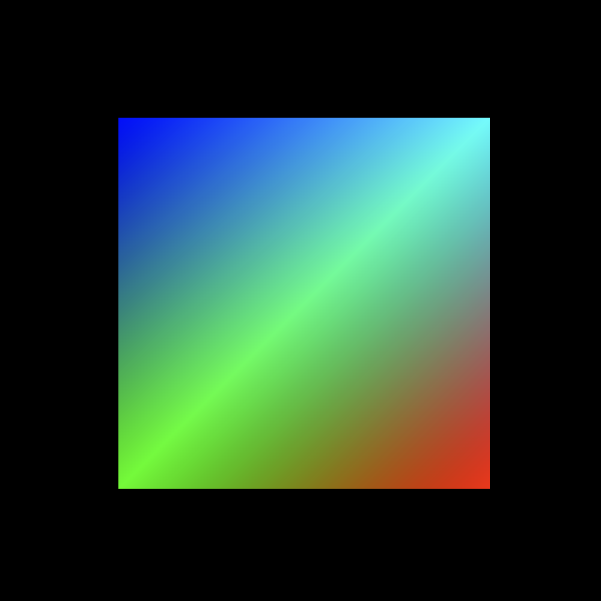
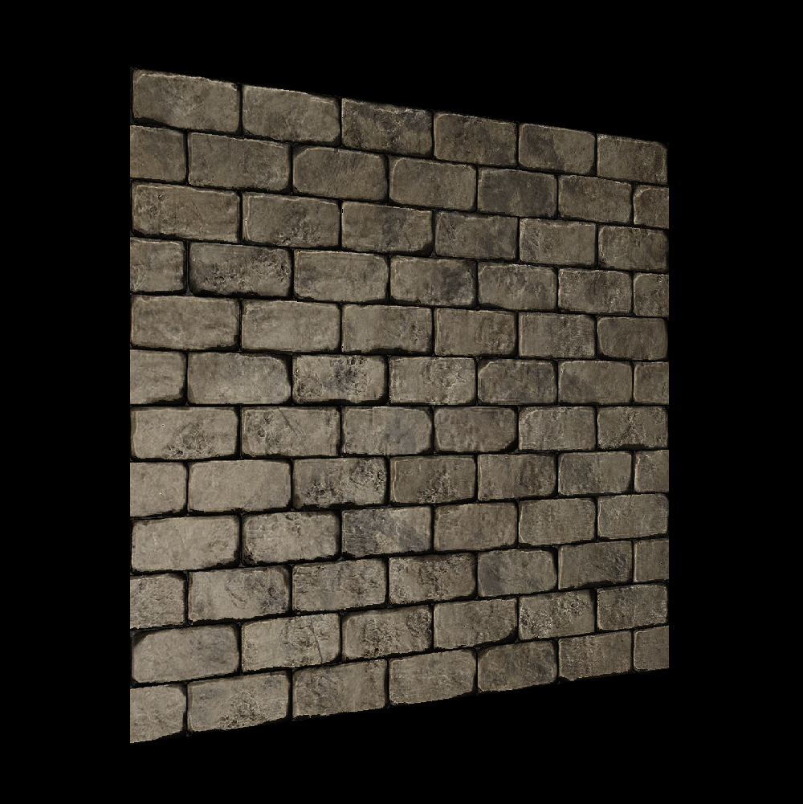
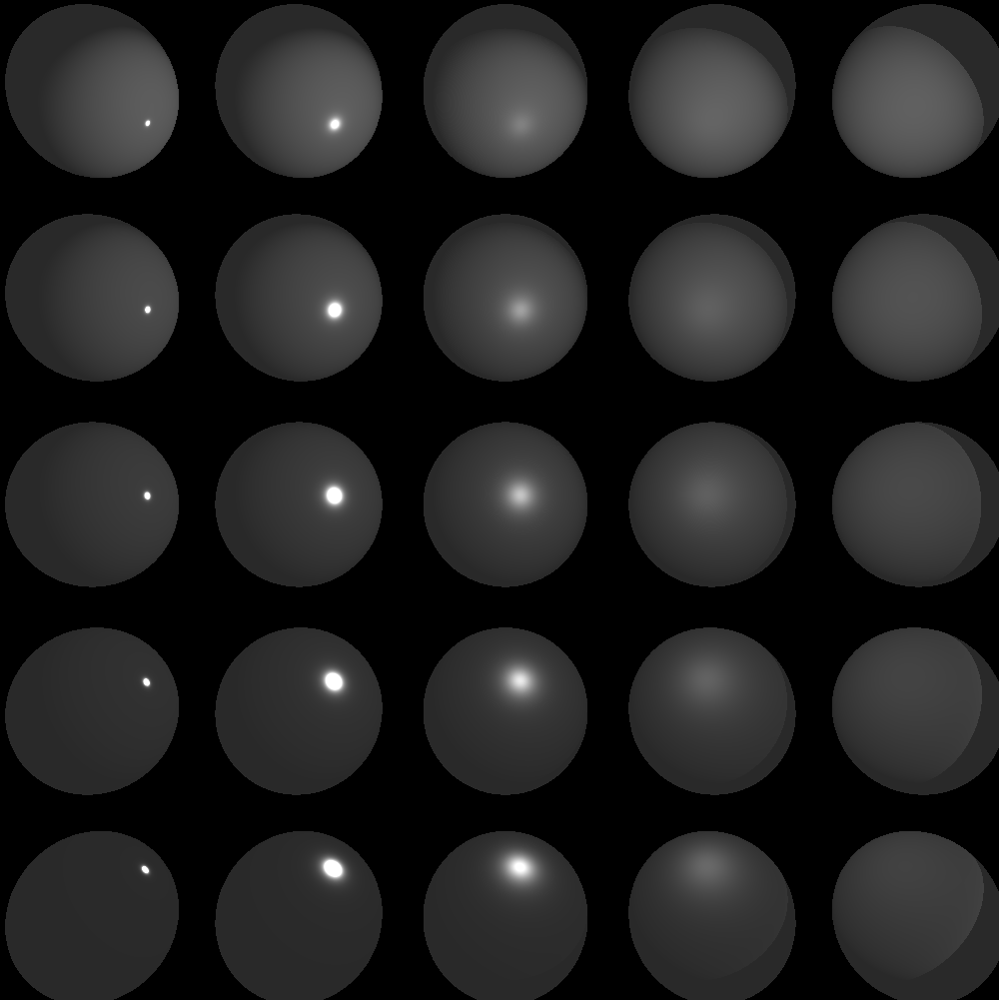
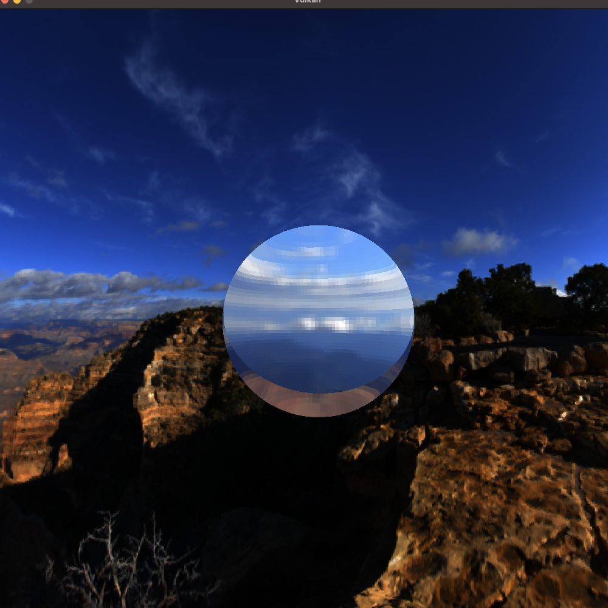
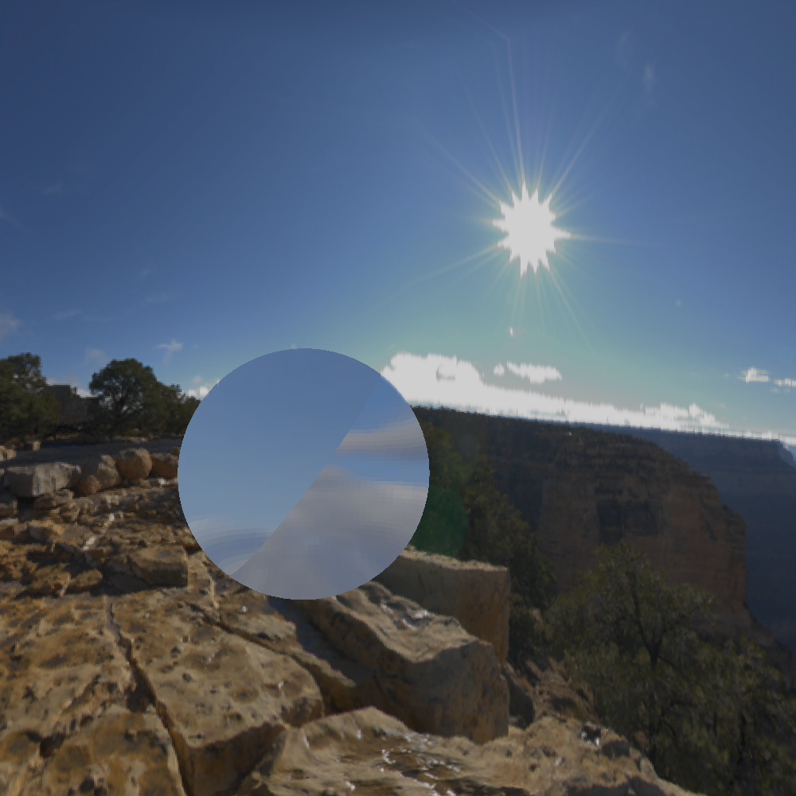

# Welcome to Umoc engine

Umoc is a Vulkan renderer for practice.
It supports Windows & Mac at this time.

# Samples

| Quad | Normal mapping  | Basic PBR |
|---|---|---|
|  |  |  |

| Skybox (Environment Refraction) | Bloom | IBL |
|---|---|---|
|  |  |   |

| Deferred shading | SSAO | Ray tracing |
|---|---|---|
|   |   |   |

## Git clone

```
git clone --recursive https://github.com/Umocmin/Umoc.git
git submodule init
git submodule update
```


## Development
### Code style

```
{ BasedOnStyle: MicroSoft, Language: Cpp, PointerAlignment: Left, IndentWidth: 4, ColumnLimit: 120 }
```
