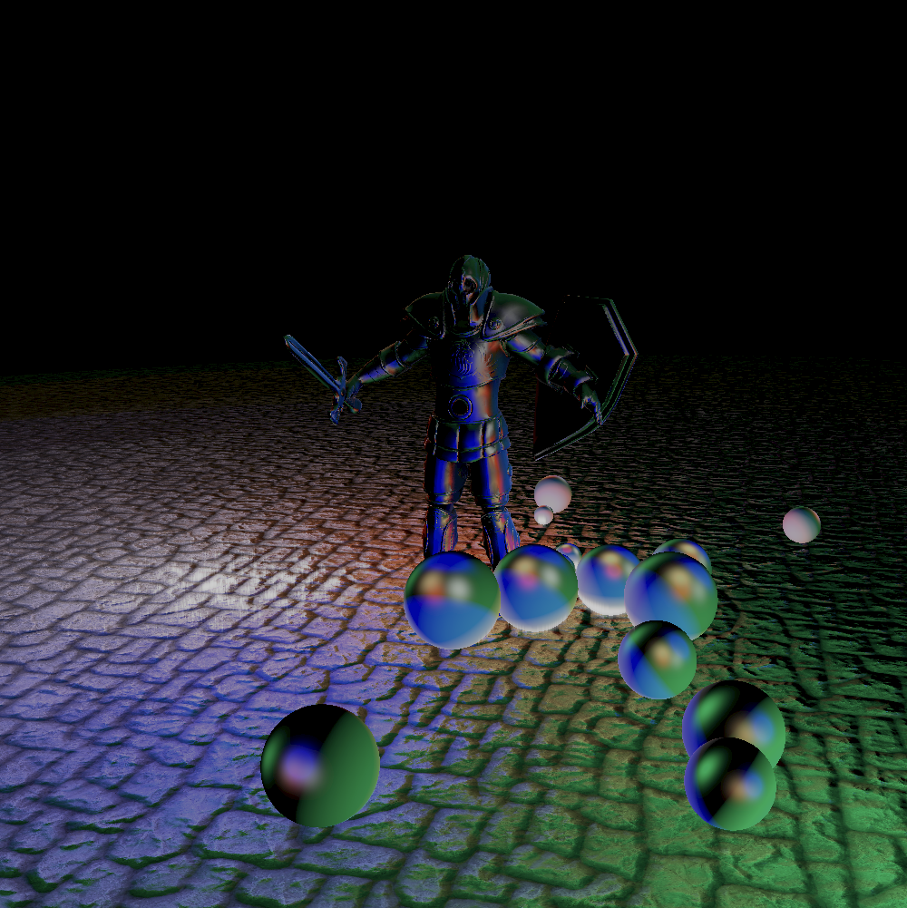
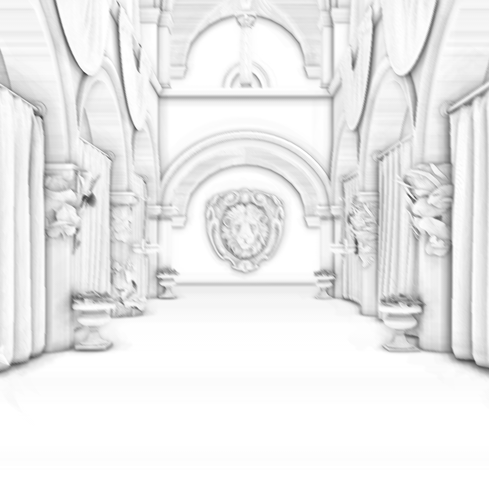
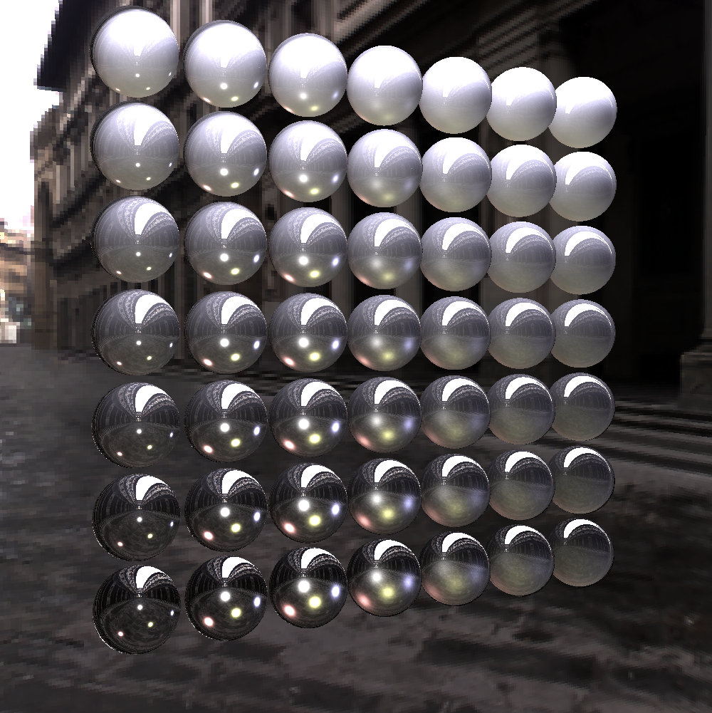

# Welcome to Umoc engine

Umoc is a Vulkan renderer for practice.
It supports Windows & Mac at this time.

# Samples

## Basic
| Quad | Normal mapping  | skybox<br/>(Environment Refraction) |
|---|---|---|
|  |  |  |

| Bloom | Deferred shading | SSAO |
|---|---|---|
|  |  |  |

## Physically Based Rendering
| PBR | IBL | TODO |
|---|---|---|
|  |  |  |


## Compute
| Sharpen | Emboss | Edge detection |
|---|---|---|
|  |  |  |

| Particles | N-body particles | TODO |
|---|---|---|
|  |  |  |

## Git clone

```
git clone --recursive https://github.com/moonykang/umoc.git
git submodule init
git submodule update
```


## Development
### Code style

```
{ BasedOnStyle: MicroSoft, Language: Cpp, PointerAlignment: Left, IndentWidth: 4, ColumnLimit: 120 }
```
## Reference

https://learnopengl.com

https://github.com/SaschaWillems/Vulkan